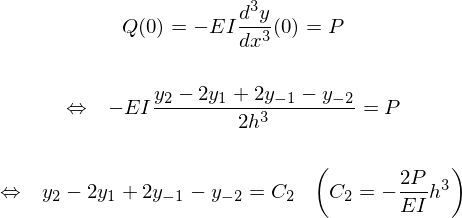

# Pile Analyser

杭の多層地盤解析を行うWebアプリです。地盤は非線形、線形、共に対応しています。
herokuにデプロイしていますが、非常に遅いのでローカルで実行することをお勧めします。

## Usage

### 解析方法の設定

- Analysis mode

地盤の非線形性を考慮するかどうかを設定します。

- Reduction mode

地盤の非線形性を考慮する場合のみ有効。変位による地盤の水平反力係数低減を、各レベルごとに行うか、杭頭変位を一律で適用するかの差になります。

- Pile top condition

杭頭固定度。固定かピンか選びます。反剛接合は未実装。

- Material

杭体の材料です。スチールにするということは鋼管杭だと思いますが、板厚入力未実装なので無垢材になってしまいいます。

### 解析条件の設定

- Level

ボーリング天端からの杭天端レベルを設定してください。

### 地盤情報ファイルのアップロード

`./sample.xlsx` を参考に作成してアップロードしてください。
標準貫入試験結果、土質、液状化低減係数、実測したE0を入力します。

### 解析精度の設定

行列のサイズを設定します。大きくした方が精度は上がりますが、計算が遅くなります。
ローカルだと500でもまず問題ないですが、ウェブアプリ上だとかなり厳しいです。気をつけてください。

## Theory

線形地盤における基本方程式は、

である。ここで、 は水平地盤反力係数。
初期値が不明なため、差分法を用いて解析を行う。差分法による表現は下記となる。

境界条件は、まず杭頭について、

また、杭頭の回転剛性  を用いて、

杭脚についての境界条件は、ローラー支点を仮定して、

以上より、一般化された行列として下記を組み立てることができる。

あとは両辺に左から逆行列を乗ずることによって、連立方程式をとけば良い。地盤の多層状態を考慮する場合は、 についてデータを与えれば良いし、地盤の非線形性を考慮する場合は、$k_h(x)$ に $y^{-1/2}$ を乗じて収斂計算を行えば良い。

## Licence
MIT

## Author
Ryuhei Fujita
